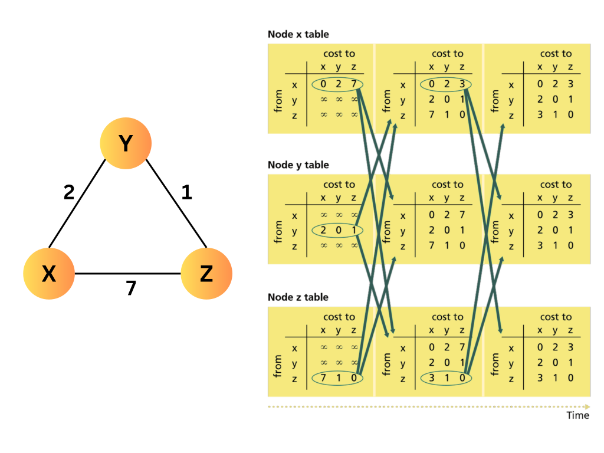

## Introduction
- The Distance Vector (DV) routing algorithm is a iterative, asynchronous, and distributed approach for computing shortest paths in a network.
- Each node maintains a **distance vector**, which estimates the cost to all other nodes in the network.
- Nodes exchange their distance vectors with neighbors to update and optimize routing paths dynamically.

## Routing Information Maintained by Each Node
- **Neighbor Costs:** Each node knows the cost to directly connected neighbors.
- **Distance Vector:** A table containing cost estimates to all destinations in the network.

## Distance Vector Update Process
- Each node periodically sends its **distance vector** to its directly connected neighbors.
- When a node receives a new distance vector from a neighbor, it updates its own vector using the **Bellman-Ford equation**:
  
  **Dx(y) = minv {c(x, v) + Dv(y)}**
  
  where:
  - `Dₓ(y)`: Cost from node `x` to destination `y`
  - `c(x, v)`: Cost to a directly connected neighbor `v`
  - `Dᵥ(y)`: Neighbor `v`'s cost to destination `y`
- If a node's distance vector changes after an update, it propagates the updated vector to its neighbors.

## Characteristics of Distance Vector Routing
- **Distributed and Asynchronous:** Nodes update independently without centralized control.
- **Iterative Process:** Updates continue until all nodes have the best possible routes.
- **Slow Convergence:** The algorithm may take time to stabilize after network topology changes.

### Reference Books
1. Kurose, J. F., & Ross, K. W. *Computer Networking: A Top-Down Approach*. Pearson.
2. Tanenbaum, A. S., & Wetherall, D. J. *Computer Networks*. Pearson.